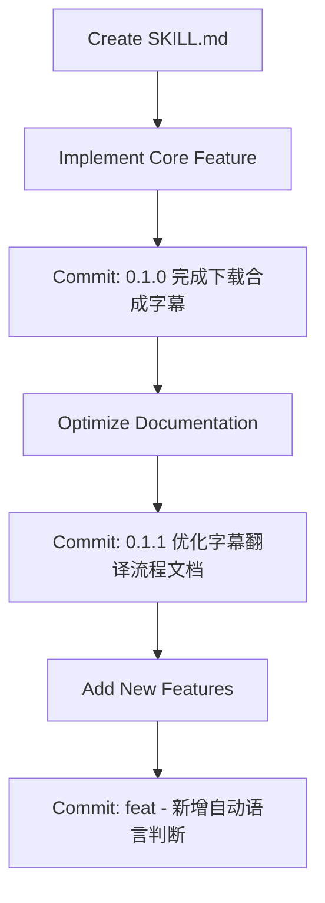

# Video Downloader Repository Patterns

This document captures the coding patterns, conventions, and workflows extracted from analyzing the video-downloader repository's git history.

## Repository Overview

**Purpose**: A video downloading tool with automatic subtitle generation and translation capabilities, using yt-dlp and pyVideoTrans.

**Tech Stack**:
- **Download Tool**: yt-dlp (supports 1000+ platforms)
- **Subtitle Processing**: pyVideoTrans (speech recognition + translation)
- **Video Processing**: FFmpeg
- **Platform**: Windows PowerShell
- **Languages**: Markdown documentation, Python CLI integration

---

## Commit Conventions

### Pattern Analysis

From the 3 commits analyzed, the repository follows a **semantic versioning + conventional commits** hybrid approach:

| Commit Type | Format | Example |
|-------------|--------|---------|
| **Feature** | `feat(scope): description` | `feat(video-downloader): 新增自动语言判断与中文字幕功能` |
| **Version** | `X.Y.Z description` | `0.1.1 优化字幕翻译流程文档` |
| **Milestone** | `X.Y.Z description` | `0.1.0 完成下载合成字幕` |

### Commit Message Guidelines

**When to use each format**:

1. **feat(scope)**: New features or significant functionality additions
   - Use Chinese for descriptions (bilingual project)
   - Include scope in parentheses (e.g., `video-downloader`)
   - Example: `feat(video-downloader): 新增自动语言判断与中文字幕功能`

2. **Version tags**: Documentation updates or minor improvements
   - Format: `X.Y.Z description`
   - Example: `0.1.1 优化字幕翻译流程文档`

3. **Milestone commits**: Major feature completion
   - Format: `X.Y.Z description`
   - Example: `0.1.0 完成下载合成字幕`

---

## Code Architecture

### Directory Structure

```
video-downloader/
├── .agent/
│   ├── skills/
│   │   └── video-downloader/
│   │       └── SKILL.md          # Main skill documentation
│   └── workflows/
│       └── video-downloader.md   # Workflow definitions
├── .claude/
│   └── commands/
│       └── video-downloader.md   # Command definitions
├── download/
│   └── {VideoName}-{YYYYMMDD}/   # Output folders (date-based)
│       ├── *.mp4                 # Original video
│       ├── *[中文字幕].mp4        # Video with subtitles
│       ├── zh-cn.srt             # Chinese subtitles
│       └── en.srt                # English subtitles
└── everything-claude-code/       # Claude Code plugin ecosystem
```

### File Organization Patterns

1. **Skill Documentation**: `.agent/skills/{skill-name}/SKILL.md`
   - Comprehensive documentation in Chinese
   - Includes usage examples, parameters, and workflows
   - Uses tables for structured information

2. **Output Organization**: `download/{Name}-{Date}/`
   - **Naming Convention**: CamelCase keywords + YYYYMMDD
   - Example: `MultipleInterests-20260128/`
   - All related files (video, subtitles, audio) in one folder

3. **Command Integration**: `.claude/commands/{command-name}.md`
   - Links skills to Claude Code CLI
   - Enables `/video-downloader` command invocation

---

## Workflows

### 1. Adding New Features to Skills

**Pattern observed from commit history**:

```
Step 1: Modify SKILL.md documentation
Step 2: Test the feature implementation
Step 3: Commit with feat(scope) format
```

**File Change Pattern**:
- Primary file: `.agent/skills/video-downloader/SKILL.md`
- All 3 commits modified this file
- Indicates iterative documentation-driven development

### 2. Version Progression

**Observed versioning pattern**:

```
0.1.0 → Initial feature completion (下载合成字幕)
0.1.1 → Documentation optimization (优化字幕翻译流程文档)
0.1.x → Feature enhancement (新增自动语言判断与中文字幕功能)
```

**Pattern**: Semantic versioning with Chinese descriptions
- **0.1.0**: Core functionality complete
- **0.1.1**: Documentation improvements
- **0.1.x+**: Feature additions

### 3. Skill Development Workflow

Based on the commit sequence:



**Key Insight**: Documentation is updated with each feature iteration, maintaining accuracy.

---

## Documentation Patterns

### 1. Bilingual Documentation

**Language Strategy**:
- **Primary Language**: Chinese (Simplified)
- **Technical Terms**: English (yt-dlp, FFmpeg, pyVideoTrans)
- **Code Examples**: PowerShell with English commands

### 2. SKILL.md Structure

**Standard sections observed**:

```markdown
---
name: skill-name
description: 中文描述
---

# 技能名称 (English Name)

## 触发方式
## 核心功能
## 参数说明
## 使用示例
## 执行流程
## 错误处理
## 常用命令参考
## 环境配置
```

### 3. Table-Heavy Documentation

**Pattern**: Extensive use of tables for clarity

| Section | Table Usage |
|---------|-------------|
| 参数说明 | Parameter definitions with defaults |
| 核心功能 | Feature descriptions with icons |
| 命令选项 | Command mappings |
| 错误处理 | Error types and solutions |

### 4. Step-by-Step Execution Flows

**Pattern**: Numbered steps with code blocks

```markdown
### Step 1: 获取视频信息
```powershell
yt-dlp --get-title "<URL>"
```

### Step 2: 判断语言并设置参数
...
```

---

## Testing Patterns

### Implicit Testing Strategy

**No explicit test files found**, but testing is implied through:

1. **Iterative Documentation Updates**
   - Each commit refines the workflow
   - Suggests manual testing between commits

2. **Error Handling Section**
   - Comprehensive error scenarios documented
   - Indicates real-world testing and edge case discovery

3. **Backup Solutions**
   - FFmpeg fallback for pyVideoTrans failures
   - Shows defensive programming mindset

---

## Integration Patterns

### 1. External Tool Integration

**Pattern**: CLI tool orchestration via PowerShell

```powershell
# Tool 1: yt-dlp (download)
yt-dlp -f "best" -o "path" "url"

# Tool 2: pyVideoTrans (subtitle translation)
python.exe cli.py --task vtv --name "video"

# Tool 3: FFmpeg (subtitle burning)
ffmpeg -i "video.mp4" -vf "subtitles='sub.srt'" "output.mp4"
```

### 2. Asynchronous Command Execution

**Pattern**: Background execution with status monitoring

```powershell
# Start command (WaitMsBeforeAsync=500)
yt-dlp ... # Runs in background

# Monitor progress
command_status -CommandId <ID> -WaitDurationSeconds 15

# Wait for completion (Exit code: 0)
```

### 3. File Path Handling

**Pattern**: Absolute paths for external tools

```
D:\pyVideoTrans\.venv\Scripts\python.exe
D:\pyVideoTrans\cli.py
D:\pyVideoTrans\output\
```

**Reason**: Ensures reliability across different working directories

---

## Naming Conventions

### 1. File Naming

| Type | Convention | Example |
|------|-----------|---------|
| **Skill files** | `{name}/SKILL.md` | `video-downloader/SKILL.md` |
| **Output folders** | `{Keywords}-{YYYYMMDD}` | `MultipleInterests-20260128` |
| **Subtitle files** | `{lang-code}.srt` | `zh-cn.srt`, `en.srt` |
| **Processed videos** | `{name} [中文字幕].mp4` | `Video [中文字幕].mp4` |

### 2. Variable Naming (PowerShell)

```powershell
$folderName    # camelCase for variables
$outputDir     # descriptive names
```

### 3. Parameter Naming

**Pattern**: Snake_case for CLI parameters

```
--source_language_code
--target_language_code
--subtitle_type
```

---

## Configuration Management

### 1. Hardcoded Paths

**Pattern**: Environment-specific paths in documentation

```markdown
- 安装位置：`D:\pyVideoTrans`
- Python 环境：`D:\pyVideoTrans\.venv\Scripts\python.exe`
```

**Implication**: Single-user/single-machine setup (not production-ready)

### 2. Default Values Strategy

**Pattern**: Sensible defaults with override options

| Parameter | Default | Rationale |
|-----------|---------|-----------|
| `quality` | `best` | Maximize quality by default |
| `subtitle` | `auto` | Intelligent language detection |
| `audio_only` | `false` | Video is primary use case |
| `subtitle_type` | `1` | Hard subtitles (most compatible) |

---

## Error Handling Philosophy

### Pattern: Graceful Degradation

**Observed approach**:

1. **Primary Method**: pyVideoTrans (AI-powered translation)
2. **Fallback Method**: FFmpeg (manual subtitle burning)
3. **User Guidance**: Clear error messages with solutions

**Example**:

```markdown
| 错误类型 | 处理方式 |
|---------|---------|
| pyVideoTrans 失败 | 检查路径和 API 配置，提供手动烧录备选方案 |
```

---

## Key Takeaways

### 1. Documentation-First Development

- **Every feature** is documented in SKILL.md before/during implementation
- Documentation serves as both spec and user guide
- Bilingual approach supports Chinese users with English technical terms

### 2. Iterative Refinement

- Small, focused commits (3 commits, 1 file)
- Each commit improves the skill incrementally
- Version numbers track progress

### 3. User-Centric Design

- Automatic language detection (no user input needed)
- Sensible defaults minimize configuration
- Comprehensive error handling with solutions

### 4. Tool Orchestration

- Leverages best-in-class tools (yt-dlp, pyVideoTrans, FFmpeg)
- PowerShell scripts coordinate multi-tool workflows
- Asynchronous execution for long-running tasks

---

## Recommendations for Future Development

Based on observed patterns:

1. **Add Configuration File**
   - Move hardcoded paths to `config.json`
   - Support multiple environments

2. **Implement Logging**
   - Track download history
   - Debug subtitle translation failures

3. **Add Test Suite**
   - Unit tests for language detection logic
   - Integration tests for tool orchestration

4. **Version Control for Outputs**
   - Git-ignore `download/` folder
   - Keep only source code and documentation in repo

5. **Expand Commit Types**
   - Add `docs:`, `fix:`, `refactor:` prefixes
   - Maintain consistency with conventional commits

---

**Generated by**: Claude Code `/skill-create` command
**Analysis Date**: 2026-01-30
**Repository**: video-downloader
**Commits Analyzed**: 3 (d1bb029, 310a25c, 4b26aab)
